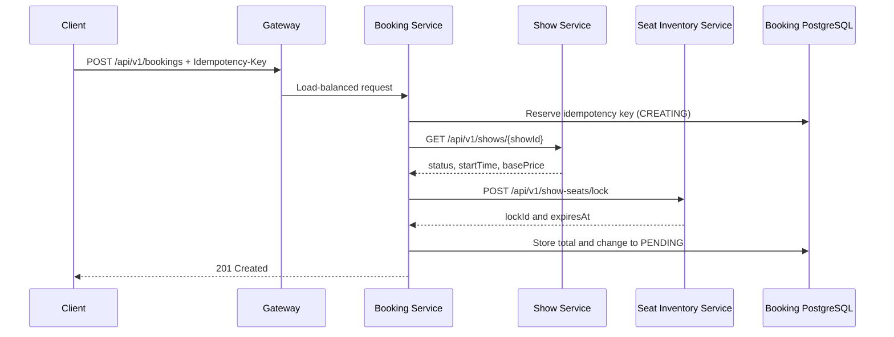

# Booking Service architecture and create flow

## What problem does this service solve?

Show Service owns show information and pricing. Seat Inventory Service owns the
availability and temporary locking of seats. Neither service should own a user's
booking lifecycle.

Booking Service is the workflow coordinator. It combines those capabilities and
stores the user's booking record.

## Why `PENDING`?

A seat lock is not a completed sale. `PENDING` means:

- the selected seats are reserved temporarily;
- the user still needs to pay;
- `paymentDeadline` is the seat lock expiration;
- a later payment flow will change the booking to `CONFIRMED`;
- an unpaid booking will eventually become `EXPIRED`.

## Ownership boundaries

| Data or rule | Owner |
|---|---|
| Show schedule and base price | Show Service |
| Current seat availability and lock | Seat Inventory Service |
| Booking status, total, user, and selected seats | Booking Service |
| Public routing, CORS, rate limiting, gateway circuit breaker | API Gateway |
| Service instance locations | Eureka registry |

The Booking database does not use foreign keys into another service's database.
Microservices communicate through APIs and keep their databases private.

## Important classes

- `BookingController`: HTTP contract only.
- `BookingService`: coordinates the workflow and business rules.
- `BookingPersistenceService`: provides short, separate database transactions.
- `ShowServiceClient` and `SeatInventoryClient`: Feign API boundaries.
- `Booking`: domain state and persistence mapping.
- `GlobalExceptionHandler`: stable Problem Detail errors.

## Why network calls are outside a database transaction

A remote service may take seconds or fail. Holding a database transaction and
connection while waiting would increase lock time, consume the connection pool,
and still could not make PostgreSQL and Redis one atomic transaction.

The implementation therefore uses short transactions before and after the
remote calls, then uses compensation if the second transaction fails.
