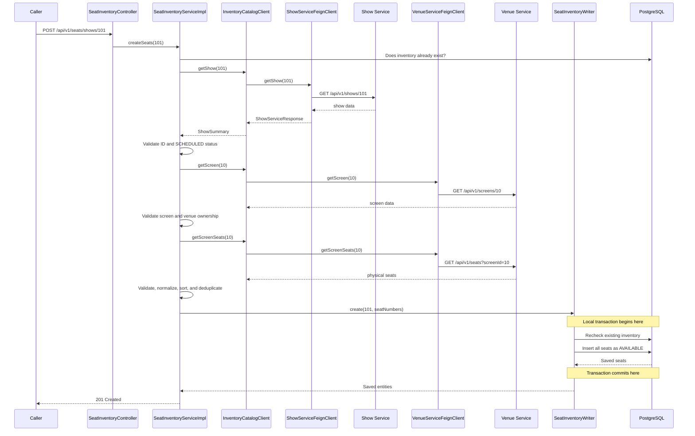

# Feign Client and Inventory Creation Learning Guide

This guide explains how Seat Inventory Service now communicates with Show
Service and Venue Service, how OpenFeign creates HTTP clients, why the code has
both Feign interfaces and a business client interface, and why the database
transaction starts only after the network calls finish.

## The business problem

The first implementation accepted this request:

```http
POST /api/v1/seats/shows/101
Content-Type: application/json

{
  "seatNumbers": ["A1", "A2", "A3"]
}
```

That allowed a caller to invent data:

- show `101` might not exist;
- show `101` might be cancelled;
- the supplied screen seats might be wrong;
- `Z99` might not be a physical seat in the screen;
- the seats might belong to a different screen.

The improved endpoint is:

```http
POST /api/v1/seats/shows/101
```

There is no request body. The services that own the source data provide it:

- Show Service owns shows and their `screenId`, `venueId`, and status.
- Venue Service owns screens and physical seat layouts.
- Seat Inventory Service owns the per-show status of those seats.

This is an important microservice rule:

> A service should obtain authoritative data from the service that owns it,
> then store only the data needed for its own business responsibility.

## Complete creation flow



## Why OpenFeign fits this use case

OpenFeign is a declarative HTTP client. Instead of manually building an HTTP
request, executing it, decoding JSON, and repeating that setup for every
endpoint, the application declares a Java interface that describes the remote
API.

Feign fits here because:

- inventory creation needs immediate answers before it can continue;
- there are only a few small synchronous GET requests;
- the upstream services already expose HTTP APIs;
- the caller needs an immediate success or failure response;
- Spring can configure URLs, timeouts, JSON conversion, and dependency
  injection around the interfaces.

Feign would not automatically be the best choice for every interaction. For
example, show cancellation may later be better delivered as an event because
Seat Inventory should learn about it asynchronously without polling Show
Service.

## Synchronous meaning

Feign calls in this service are synchronous and blocking:

```text
Seat Inventory sends request
        ↓
Current request thread waits
        ↓
Remote service responds or times out
        ↓
Seat Inventory continues
```

This is acceptable for the low-frequency inventory-creation operation. It is
intentionally not used in these high-frequency operations:

```text
GET  seats
POST lock
POST confirm
POST release
POST block
POST unblock
```

Those operations use the local inventory database, so customer checkout does
not fail merely because Show Service or Venue Service is temporarily down.

## Dependency and activation

The Maven dependency is:

```xml
<dependency>
    <groupId>org.springframework.cloud</groupId>
    <artifactId>spring-cloud-starter-openfeign</artifactId>
</dependency>
```

Feign scanning is activated in the application class:

```java
@SpringBootApplication
@EnableFeignClients
public class SeatInventoryServiceApplication {
}
```

`@EnableFeignClients` tells Spring to search for interfaces annotated with
`@FeignClient`. Spring creates runtime proxy objects for those interfaces and
registers the proxies as beans.

There is no handwritten implementation of `ShowServiceFeignClient`. When code
calls its method, the proxy turns that Java method call into an HTTP request.

## Show Service Feign client

The declaration is:

```java
@FeignClient(
    name = "show-service",
    url = "${clients.show-service.base-url}"
)
public interface ShowServiceFeignClient {

    @GetMapping("/api/v1/shows/{showId}")
    ShowServiceResponse getShow(
        @PathVariable("showId") Long showId
    );
}
```

For `showId = 101` and the default configuration, Feign builds:

```text
Base URL: http://localhost:8083
Path:     /api/v1/shows/101

Final request:
GET http://localhost:8083/api/v1/shows/101
```

### `name`

```java
name = "show-service"
```

The name identifies this Feign client. It is also used by the configuration
keys for this client:

```properties
spring.cloud.openfeign.client.config.show-service.connect-timeout=2000
```

### `url`

```java
url = "${clients.show-service.base-url}"
```

The URL comes from application configuration instead of being hardcoded in
Java. Local development and deployed environments can therefore use different
addresses without recompiling the application.

### `@GetMapping`

```java
@GetMapping("/api/v1/shows/{showId}")
```

This declares the HTTP method and remote path.

### `@PathVariable`

```java
@PathVariable("showId") Long showId
```

Feign replaces `{showId}` in the path with the Java argument.

## Venue Service Feign client

Venue Service has two required operations:

```java
@GetMapping("/api/v1/screens/{screenId}")
ScreenServiceResponse getScreen(
    @PathVariable("screenId") Long screenId
);

@GetMapping("/api/v1/seats")
List<SeatServiceResponse> getScreenSeats(
    @RequestParam("screenId") Long screenId
);
```

For `screenId = 10`, these become:

```http
GET http://localhost:8082/api/v1/screens/10
```

and:

```http
GET http://localhost:8082/api/v1/seats?screenId=10
```

`@RequestParam` becomes a query parameter, whereas `@PathVariable` replaces a
value inside the URL path.

## How JSON becomes Java records

Show Service may return a larger JSON document:

```json
{
  "id": 101,
  "eventId": "event-7",
  "venueId": 1,
  "screenId": 10,
  "startTime": "2026-08-10T18:00:00",
  "endTime": "2026-08-10T21:00:00",
  "basePrice": 250.00,
  "status": "SCHEDULED"
}
```

Seat Inventory only needs:

```java
record ShowServiceResponse(
    Long id,
    Long venueId,
    Long screenId,
    String status
) {
}
```

Feign uses Spring's HTTP message conversion to decode the JSON. Matching field
names populate the record, while unrelated response fields are not part of
this client model.

This is preferable to importing Show Service's entity or DTO classes because:

- the services remain independently buildable;
- Seat Inventory depends only on fields it actually uses;
- internal changes in Show Service have a smaller chance of breaking it;
- database entities are not shared across service boundaries.

## Why there are two client layers

The project contains both:

```text
ShowServiceFeignClient / VenueServiceFeignClient
```

and:

```text
InventoryCatalogClient
```

They solve different problems.

### Feign interfaces: transport contract

The Feign interfaces know:

- HTTP paths;
- path and query parameters;
- external response shapes;
- remote client names.

They answer:

> How do we call the remote HTTP services?

### `InventoryCatalogClient`: business dependency

The business interface is:

```java
public interface InventoryCatalogClient {
    ShowSummary getShow(Long showId);
    ScreenSummary getScreen(Long screenId);
    List<ScreenSeatSummary> getScreenSeats(Long screenId);
}
```

It does not mention Feign, HTTP URLs, or remote DTO names. It answers:

> What external catalog information does Seat Inventory need?

### Adapter implementation

`FeignInventoryCatalogClient` implements the business interface by using both
Feign clients:

```text
SeatInventoryServiceImpl
        ↓ depends on
InventoryCatalogClient
        ↑ implemented by
FeignInventoryCatalogClient
        ↓ calls
ShowServiceFeignClient and VenueServiceFeignClient
```

This is an adapter pattern and dependency inversion.

Benefits:

- business tests mock `InventoryCatalogClient`, not HTTP machinery;
- Feign-specific exceptions stay out of the service layer;
- another implementation could use messaging or a stub later;
- remote response DTOs do not spread through the business code.

## What `@Component` and constructor injection do

The adapter has:

```java
@Component
@RequiredArgsConstructor
public class FeignInventoryCatalogClient
        implements InventoryCatalogClient {

    private final ShowServiceFeignClient showServiceClient;
    private final VenueServiceFeignClient venueServiceClient;
}
```

- `@Component` registers the adapter as a Spring bean.
- `@RequiredArgsConstructor` creates a constructor for both final fields.
- Spring injects the two Feign proxy beans into that constructor.
- `SeatInventoryServiceImpl` requests `InventoryCatalogClient`, so Spring
  injects the adapter implementation.

## Error translation

Feign reports HTTP and connection failures using Feign exceptions. Those are
transport details and should not leak through the Seat Inventory API.

The adapter translates them:

| Feign result | Internal exception | Seat API response |
|---|---|---:|
| Remote `404` | `ResourceNotFoundException` | `404 Not Found` |
| Connection failure or timeout | `ExternalServiceException` | `503 Service Unavailable` |
| Other remote HTTP error | `ExternalServiceException` | `503 Service Unavailable` |
| Null/invalid remote response | `ExternalServiceException` | `503 Service Unavailable` |

The common helper is:

```java
private <T> T call(
        Supplier<T> request,
        String notFoundMessage,
        String serviceName
) {
    try {
        return request.get();
    } catch (FeignException.NotFound ex) {
        throw new ResourceNotFoundException(notFoundMessage);
    } catch (RetryableException ex) {
        throw new ExternalServiceException(
            serviceName + " is unavailable or timed out",
            ex
        );
    } catch (FeignException ex) {
        throw new ExternalServiceException(
            serviceName + " returned HTTP " + ex.status(),
            ex
        );
    }
}
```

### Why `Supplier<T>` is used

The show, screen, and seat calls return different Java types. `Supplier<T>`
represents a no-argument operation that returns a value of type `T`.

Example:

```java
() -> showServiceClient.getShow(showId)
```

The lambda is passed into `call()`. The helper executes it using:

```java
request.get()
```

This allows one error-translation implementation to wrap all three remote
calls without duplicating the same `try/catch` blocks.

## Global HTTP error mapping

`GlobalExceptionHandler` converts internal exceptions into the public API
format.

If Show Service is unavailable:

```json
{
  "status": 503,
  "error": "Service Unavailable",
  "message": "show-service is unavailable or timed out",
  "path": "/api/v1/seats/shows/101",
  "details": []
}
```

If show `101` does not exist:

```json
{
  "status": 404,
  "error": "Not Found",
  "message": "Show not found with id: 101",
  "path": "/api/v1/seats/shows/101",
  "details": []
}
```

This separation keeps responsibilities clear:

```text
Feign adapter translates transport failure into domain exception
        ↓
Global handler translates domain exception into HTTP response
```

## Timeout configuration

The service URLs are:

```properties
clients.show-service.base-url=${SHOW_SERVICE_URL:http://localhost:8083}
clients.venue-service.base-url=${VENUE_SERVICE_URL:http://localhost:8082}
```

The syntax means:

```text
Use the environment variable when present
Otherwise use the value after the colon
```

Feign timeouts are configured per named client:

```properties
spring.cloud.openfeign.client.config.show-service.connect-timeout=${CLIENT_CONNECT_TIMEOUT_MS:2000}
spring.cloud.openfeign.client.config.show-service.read-timeout=${CLIENT_READ_TIMEOUT_MS:3000}

spring.cloud.openfeign.client.config.venue-service.connect-timeout=${CLIENT_CONNECT_TIMEOUT_MS:2000}
spring.cloud.openfeign.client.config.venue-service.read-timeout=${CLIENT_READ_TIMEOUT_MS:3000}
```

### Connect timeout

The connect timeout limits how long the client waits to establish a network
connection.

Examples:

- service is stopped;
- wrong host or port;
- network route cannot be established.

### Read timeout

The read timeout limits how long the client waits for the remote response after
a connection has been established.

Example:

- Venue Service accepts the connection but its database query is stuck.

Timeouts are essential because an unbounded wait can consume all request
threads and make Seat Inventory unavailable.

## Detailed business validation

Feign successfully returning `200` does not mean the business data is valid.
`SeatInventoryServiceImpl` performs additional validation.

### Early duplicate check

```java
if (showSeatRepository.existsByShowId(showId)) {
    throw new SeatConflictException(...);
}
```

This avoids three unnecessary remote calls when inventory already exists.

### Show validation

The show response must contain:

```text
id
venueId
screenId
status
```

The returned ID must match the requested ID, and status must be:

```text
SCHEDULED
```

`CANCELLED` and `COMPLETED` shows cannot receive new inventory.

### Screen validation

The returned screen must:

- contain an ID and venue ID;
- match the show's `screenId`;
- belong to the show's `venueId`.

This is a defensive consistency check between two services.

### Physical-seat validation

The returned layout must:

- not be null;
- contain at least one seat;
- contain seats belonging to the expected screen;
- contain valid seat numbers;
- contain no duplicate seat numbers after normalization.

Seat numbers are trimmed, converted to uppercase, sorted, and validated before
they are persisted.

## Why the remote calls are outside the database transaction

`SeatInventoryServiceImpl.createSeats()` intentionally does not have
`@Transactional`.

A poor transaction boundary would be:

```text
Open database transaction
→ Call Show Service and wait
→ Call Venue Service and wait
→ Call Venue Service again and wait
→ Insert seats
→ Commit
```

That holds a database connection and transaction open while waiting on the
network. It can cause:

- wasted connection-pool capacity;
- longer transactions;
- more contention;
- greater impact from slow external services.

The implemented boundary is:

```text
Call and validate external services
        ↓
Open short local transaction
        ↓
Insert inventory
        ↓
Commit immediately
```

`SeatInventoryWriter.create()` owns that short transaction:

```java
@Transactional
public List<ShowSeat> create(
        Long showId,
        List<String> seatNumbers
) {
    // Recheck
    // Build entities
    // saveAll
}
```

## Why a separate writer bean is needed

Spring normally applies `@Transactional` through a proxy around a Spring bean.
Calling a private or same-class transactional method directly can bypass that
proxy.

Using a separate injected `SeatInventoryWriter` ensures the call crosses a
Spring bean boundary:

```text
SeatInventoryServiceImpl
        ↓ calls Spring proxy
SeatInventoryWriter @Transactional
        ↓
Database transaction
```

It also makes the orchestration and persistence responsibilities clear:

- `SeatInventoryServiceImpl` coordinates and validates.
- `SeatInventoryWriter` performs the atomic local write.

## Why inventory existence is checked twice

There is an early check before remote calls and another inside the writer.

### First check

```text
Purpose: avoid unnecessary remote calls
```

### Transactional recheck

```text
Purpose: detect another request that created inventory while this request was
calling Show and Venue Services
```

The database unique constraint on `(show_id, seat_number)` is the final safety
net if concurrent transactions still race past both checks.

This demonstrates defense in depth:

```text
Fast application check
→ transactional application check
→ database constraint
```

## Why remote DTOs are not stored directly

Venue Service returns physical-seat information such as row, index, and seat
type. Seat Inventory currently needs only the seat number to create show-level
availability.

It creates its own rows:

```text
showId = 101
seatNumber = A1
status = AVAILABLE
```

It does not store Venue Service entities or foreign JPA relationships. A
microservice cannot use a JPA relationship across separate databases.

## Success example

Assume Show Service returns:

```json
{
  "id": 101,
  "venueId": 1,
  "screenId": 10,
  "status": "SCHEDULED"
}
```

Venue Service returns screen:

```json
{
  "id": 10,
  "venueId": 1
}
```

and seats:

```json
[
  {"seatNumber": "A1", "screenId": 10},
  {"seatNumber": "A2", "screenId": 10},
  {"seatNumber": "B1", "screenId": 10}
]
```

Calling:

```http
POST /api/v1/seats/shows/101
```

creates:

| show_id | seat_number | status |
|---:|---|---|
| 101 | A1 | AVAILABLE |
| 101 | A2 | AVAILABLE |
| 101 | B1 | AVAILABLE |

## Failure scenarios

### Show does not exist

```text
Show Service returns 404
→ FeignException.NotFound
→ ResourceNotFoundException
→ Seat API returns 404
→ no inventory written
```

### Show is cancelled

```text
Show Service returns status CANCELLED
→ SeatConflictException
→ Seat API returns 409
→ Venue Service is not called
→ no inventory written
```

### Screen belongs to another venue

```text
Show venueId = 1
Screen venueId = 2
→ 409 Conflict
→ no seats requested or written
```

### Screen has no seats

```text
Venue Service returns []
→ 409 Conflict
→ no inventory written
```

### Venue Service is down

```text
Connection/timeout failure
→ RetryableException
→ ExternalServiceException
→ 503 Service Unavailable
→ no inventory written
```

### Two creation requests race

```text
Both pass the early check
→ both call external services
→ first writer commits
→ second writer recheck detects inventory
→ second request receives 409
```

## How to debug the flow

Start Venue Service on `8082`, Show Service on `8083`, and Seat Inventory
Service on `8084`.

Add breakpoints in this order:

1. `SeatInventoryController.createSeats()` — inspect `showId`.
2. `SeatInventoryServiceImpl.createSeats()` — follow orchestration.
3. `ShowServiceFeignClient.getShow()` call site in the adapter.
4. `FeignInventoryCatalogClient.call()` — observe lambda execution and errors.
5. `validateShow()` — inspect show ID, status, venue, and screen.
6. `validateScreen()` — inspect cross-service consistency.
7. `normalizeAndValidateSeatNumbers()` — inspect physical layout conversion.
8. `SeatInventoryWriter.create()` — observe where the transaction begins.
9. `showSeatRepository.saveAll()` — inspect entities before persistence.

Feign interfaces themselves contain no implementation to step through. Step
into the adapter call and then use HTTP logging or breakpoints in the target
service controller to observe the remote request.

With basic Feign logging configured, raise the relevant application logger to
`DEBUG` temporarily if request-level Feign diagnostics are needed. Do not log
sensitive authorization headers or customer data in production.

## How to run the main test

After valid event, venue, screen, physical seats, and show data have been
created in their owning services, call:

```http
POST http://localhost:8084/api/v1/seats/shows/{realShowId}
```

Then verify:

```http
GET http://localhost:8084/api/v1/seats/shows/{realShowId}
```

Calling creation a second time should return `409 Conflict` without calling
the external services again.

## Automated tests

The implementation has separate test responsibilities.

### `FeignInventoryCatalogClientTests`

These tests mock the raw Feign interfaces and verify:

- external show responses map to the business summary;
- seat-list responses map correctly;
- remote `404` becomes a domain not-found exception;
- timeout/connectivity failure becomes an external-service exception.

### `SeatInventoryServiceImplTests`

These tests mock `InventoryCatalogClient` and verify business orchestration:

- successful creation from Show and Venue data;
- cancelled show rejection;
- venue mismatch rejection;
- empty screen rejection;
- unexpected seat screen rejection;
- no write after an external failure.

### `SeatInventoryWriterTests`

These tests verify:

- every new seat starts as `AVAILABLE`;
- inventory existence is rechecked before writing.

### Context tests

The Spring context test verifies that Feign proxies, the adapter, services,
repositories, Flyway, and configuration can be wired together successfully.

Run everything with:

```powershell
.\mvnw.cmd test
```

## What Feign does and does not do

Feign does:

- create an HTTP client proxy from an annotated interface;
- substitute path and query parameters;
- send the HTTP request;
- decode successful JSON responses;
- expose HTTP/network failures as exceptions;
- use the configured URL and timeouts.

Feign does not:

- decide whether a show is allowed to create inventory;
- verify venue ownership;
- decide the API status returned to Seat Inventory callers;
- open the local database transaction;
- guarantee distributed consistency;
- automatically make a multi-service operation atomic;
- replace authentication, authorization, retries, circuit breakers, or events.

Those responsibilities belong to business logic and other resilience/security
components.

## Distributed transaction limitation

The workflow reads Show and Venue data and then writes the Seat database. It is
not one distributed ACID transaction across three databases.

For example, a show could theoretically be cancelled immediately after Seat
Inventory validates it but before inventory is inserted. This is a normal
distributed-systems concern.

Later improvements can include:

- a `ShowCancelled` event that blocks/cancels local inventory;
- idempotent event consumption;
- retries for carefully selected transient failures;
- circuit breakers and operational metrics;
- authentication between services;
- correlation IDs and distributed tracing.

Feign makes HTTP communication convenient, but it does not remove these
distributed-systems tradeoffs.

## Key lessons

1. Feign converts annotated Java method calls into synchronous HTTP requests.
2. Feign interfaces should describe transport details, not contain business
   rules.
3. A business client interface prevents Feign details from spreading into the
   service layer.
4. Remote `200` responses still require business and consistency validation.
5. Timeouts prevent dependencies from making requests wait indefinitely.
6. Transport exceptions should be translated into stable application errors.
7. Network calls should not be placed inside long local database transactions.
8. The service that owns physical seats supplies the layout; Seat Inventory
   owns only per-show seat state.
9. High-frequency seat locking remains local and does not call catalog
   services.
10. Feign simplifies communication, but distributed consistency still needs
    explicit design.
