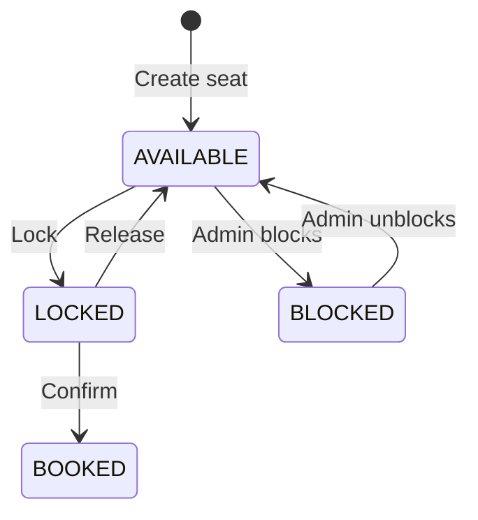
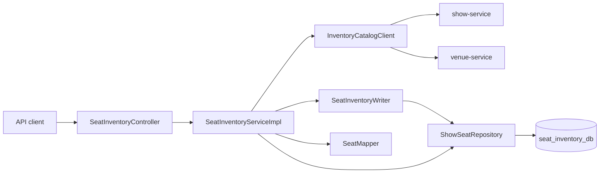

# Seat Inventory Service: Implementation and Learning Guide

This service owns the seat state for each show. The first implementation uses
PostgreSQL through Spring Data JPA. Redis expiry is intentionally **not** part
of this phase.

For a deep explanation of the Show/Venue integration and OpenFeign, read
[`FEIGN_CLIENT_AND_INVENTORY_CREATION_GUIDE.md`](FEIGN_CLIENT_AND_INVENTORY_CREATION_GUIDE.md).

## What is implemented

- Create one seat inventory for a show.
- View all seats or filter seats by status.
- Lock a selection of seats for one user.
- Release every seat belonging to a lock.
- Confirm every seat belonging to a lock as booked.
- Block available seats and unblock blocked seats.
- Reject a lock when any selected seat is missing or unavailable.
- Prevent two concurrent requests from successfully locking the same seat.

The four states are:



The block and unblock operations use the same transactional row-locking rules
as customer seat selection, so an admin operation and a customer lock cannot
both win for the same seat.

## Current non-expiring lock behavior

The current lock is stored in the `show_seats` database rows:

- `status = LOCKED`
- `lock_id = LOCK-<UUID>`
- `locked_by_user_id = <userId>`

It stays locked until the owner calls `/api/v1/seats/release` or
`/api/v1/seats/confirm`.
The lock response contains `expiresAt: null` to make the missing expiry
explicit. There is no scheduler pretending to provide Redis behavior.

This is useful as a learning step because the state transitions, transactions,
ownership checks, and concurrency problem can be understood before adding a
second data store.

## API examples

The service runs on port `8084` by default.

### Create seats for a show

```http
POST /api/v1/seats/shows/101
```

The request has no body. Seat Inventory Service calls Show Service to validate
show `101` and obtain its `screenId` and `venueId`. It then validates the screen
and loads its physical seat layout from Venue Service. Returned seat numbers
are normalized, sorted, and stored as `AVAILABLE`. A cancelled/completed show,
an empty screen, inconsistent external data, or duplicate inventory is
rejected.

Only this creation operation needs the catalog services. View, lock, confirm,
release, block, and unblock continue to use the local inventory database.

### View seats

```http
GET /api/v1/seats/shows/101
```

This returns every seat. To implement the "view available seats" use case:

```http
GET /api/v1/seats/shows/101?status=AVAILABLE
```

The other valid filters are `LOCKED`, `BOOKED`, and `BLOCKED`.

### Lock selected seats

```http
POST /api/v1/seats/lock
Content-Type: application/json

{
  "showId": 101,
  "userId": 501,
  "seatNumbers": ["A1", "A2"]
}
```

Example response in the current phase:

```json
{
  "lockId": "LOCK-550e8400-e29b-41d4-a716-446655440000",
  "showId": 101,
  "seatNumbers": ["A1", "A2"],
  "status": "LOCKED",
  "expiresAt": null
}
```

The operation is all-or-nothing. If `A2` is already `LOCKED`, `BOOKED`, or
`BLOCKED`, `A1` is not locked either.

### Confirm a lock

```http
POST /api/v1/seats/confirm
Content-Type: application/json

{
  "showId": 101,
  "userId": 501,
  "lockId": "LOCK-550e8400-e29b-41d4-a716-446655440000"
}
```

All seats for this lock become `BOOKED`. The lock metadata is removed from the
rows.

### Release a lock

```http
POST /api/v1/seats/release
Content-Type: application/json

{
  "showId": 101,
  "userId": 501,
  "lockId": "LOCK-550e8400-e29b-41d4-a716-446655440000"
}
```

All seats for this lock return to `AVAILABLE`. A different user cannot confirm
or release the lock.

### Block available seats

```http
POST /api/v1/seats/block
Content-Type: application/json

{
  "showId": 101,
  "seatNumbers": ["A3", "A4"]
}
```

All requested seats must be `AVAILABLE`; otherwise the complete request fails.
On success, they become `BLOCKED` and cannot be selected by customers.

### Unblock seats

```http
POST /api/v1/seats/unblock
Content-Type: application/json

{
  "showId": 101,
  "seatNumbers": ["A3", "A4"]
}
```

All requested seats must be `BLOCKED`; otherwise the complete request fails.
On success, they return to `AVAILABLE`.

## Code structure

```text
controller/   HTTP endpoints and request validation
client/       Business client abstraction and Feign HTTP adapters
dto/          API request and response shapes
service/      Use-case interface
service/impl/ Business rules and transaction boundaries
repository/   Database queries and row locking
entity/       Persistent seat state and state-transition methods
mapper/       Entity-to-response conversion
exception/    Domain errors and consistent HTTP error responses
resources/db/migration/  Versioned database schema
```

The request flow is:



The external calls finish before `SeatInventoryWriter` opens the local write
transaction. This avoids holding a database connection and transaction open
while waiting on the network. The writer rechecks for existing inventory
inside the transaction to handle concurrent creation attempts.

## Patterns used and the problems they solve

### Layered architecture

The controller handles HTTP, the service contains business rules, and the
repository handles persistence.

**Problem solved:** without these boundaries, HTTP details, business rules,
and SQL concerns become mixed in one class. Separation makes each part easier
to understand, test, and replace.

### Service interface pattern

`SeatInventoryService` defines the use cases while
`SeatInventoryServiceImpl` implements them.

**Problem solved:** callers depend on a business contract instead of a
specific implementation. It also creates a clear list of the service's
capabilities.

### Repository pattern

`ShowSeatRepository` hides JPA operations and exposes queries named in domain
language, including `findRequestedSeatsForUpdate` and `findLockForUpdate`.

**Problem solved:** service code expresses the locking workflow without
managing an `EntityManager` or embedding persistence mechanics everywhere.

### Feign client and adapter pattern

`ShowServiceFeignClient` and `VenueServiceFeignClient` declare the concrete
HTTP endpoints. `FeignInventoryCatalogClient` adapts those transport-specific
responses to the smaller `InventoryCatalogClient` business contract used by
the service.

**Problem solved:** business logic does not contain URLs, Feign exceptions, or
external response DTOs. A missing show/screen becomes `404`, while a timeout or
upstream failure becomes `503`. Configured connection and read timeouts prevent
inventory creation from waiting indefinitely.

### DTO pattern

Request and response records are separate from `ShowSeat`, the JPA entity.

**Problem solved:** the database model is not accidentally exposed as the API
contract. Internal columns such as `lockedByUserId`, timestamps, and the
database ID do not leak to seat-list consumers.

### Mapper pattern

`SeatMapper` converts a database entity into the public `SeatResponse`.

**Problem solved:** conversion logic has one home, and controllers do not need
to know the persistence model.

### Dependency injection and constructor injection

Spring creates repositories, services, controllers, and the mapper. Lombok's
`@RequiredArgsConstructor` creates constructors for required dependencies.

**Problem solved:** classes do not construct infrastructure dependencies by
themselves. Dependencies are visible, testable, and replaceable with mocks.

### Database migration pattern

Flyway owns the schema in `V1__create_show_seats_table.sql`, while Hibernate is
configured with `ddl-auto=validate`.

**Problem solved:** schema changes are versioned and repeatable. Hibernate
checks that the Java model matches the migrated database but does not silently
alter a production schema.

### Database constraints as a safety net

The database enforces:

- one row per `(show_id, seat_number)`;
- only the four valid status strings;
- lock metadata must exist only when status is `LOCKED`.

**Problem solved:** invalid state is rejected even if a future code path misses
an application-level check.

### Transaction boundary / Unit of Work

Every command method uses `@Transactional`. Reading, validation, and all seat
changes therefore succeed or fail as one unit.

**Problem solved:** a request for `A1` and `A2` cannot leave only `A1` locked
when validation or persistence of `A2` fails.

### Pessimistic locking

The repository applies `PESSIMISTIC_WRITE` to selected seat rows. Requested
seat numbers are normalized and sorted before the query, and the query orders
rows by seat number.

For two requests competing for `A1`:

```mermaid
sequenceDiagram
    participant R1 as Request 1
    participant DB as PostgreSQL
    participant R2 as Request 2

    R1->>DB: SELECT A1 FOR UPDATE
    DB-->>R1: A1 is AVAILABLE; row locked
    R2->>DB: SELECT A1 FOR UPDATE
    Note over R2,DB: waits for Request 1
    R1->>DB: UPDATE A1 to LOCKED; COMMIT
    DB-->>R2: row now visible as LOCKED
    R2-->>R2: reject with 409 Conflict
```

**Problem solved:** a simple "read AVAILABLE, then update" workflow has a race
condition: both requests can read `AVAILABLE` before either writes. The row
lock serializes that decision across application instances that share the
same PostgreSQL database.

Stable seat ordering also reduces deadlock risk when two requests contain
overlapping multi-seat selections in different input orders.

### State transition methods

`ShowSeat.lock`, `ShowSeat.release`, and `ShowSeat.book` change the status and
lock metadata together.

**Problem solved:** related fields cannot easily drift apart, such as a
`BOOKED` seat accidentally retaining a user lock.

### Global exception handler

`GlobalExceptionHandler` maps domain and validation errors to consistent JSON:

- `400 Bad Request` for malformed or invalid input;
- `404 Not Found` for missing seats or locks;
- `409 Conflict` for unavailable seats, wrong owners, or duplicate inventory.

**Problem solved:** business code throws meaningful exceptions without
building HTTP responses, while clients receive predictable errors.

## Why this prevents double booking

Double-booking protection is not one boolean check. It comes from these rules
working together:

1. Each show/seat pair has exactly one database row.
2. A lock transaction obtains write locks on every requested row.
3. Only `AVAILABLE` rows can transition to `LOCKED`.
4. Only rows matching an active `lockId` can transition to `BOOKED`.
5. The supplied user must own that lock.
6. Each multi-seat command commits or rolls back as one transaction.

This database approach is correct for the current service. It may have lower
throughput than Redis during very high-demand ticket drops, but it provides a
clear correctness baseline.

## What changes in the Redis phase

The future requirement is a five-minute key such as:

```text
seat-lock:show:101:seat:A1
```

with a TTL of 300 seconds and a value containing `userId` and `lockId`.

Adding Redis is not only replacing the repository query. The next design must
define:

- an atomic multi-seat acquisition operation, normally a Lua script;
- rollback when one key cannot be acquired;
- how expired Redis locks make database seats appear available;
- how confirmation verifies the complete lock before writing `BOOKED` to
  PostgreSQL;
- behavior when Redis is unavailable;
- idempotency for payment and confirmation retries;
- recovery when Redis succeeds but a later database operation fails.

A per-seat `SET NX EX 300` loop without an atomic script is unsafe because the
process can lock `A1`, fail on `A2`, and crash before releasing `A1`.

## Known boundaries of this learning phase

- Locks do not expire automatically.
- There is no Redis dependency or scheduled cleanup.
- Authentication and admin authorization for block/unblock are not implemented yet.
- Payment and booking-service idempotency are separate later concerns.

## Running locally

Create PostgreSQL database `seat_inventory_db`, or set these environment
variables:

```text
DB_URL
DB_USERNAME
DB_PASSWORD
SERVER_PORT
SHOW_SERVICE_URL
VENUE_SERVICE_URL
CLIENT_CONNECT_TIMEOUT_MS
CLIENT_READ_TIMEOUT_MS
```

Then run:

```powershell
.\mvnw.cmd spring-boot:run
```

Swagger UI is available at:

```text
http://localhost:8084/swagger-ui.html
```

Run the tests with:

```powershell
.\mvnw.cmd test
```

Tests use an isolated in-memory H2 database and do not require local
PostgreSQL.
