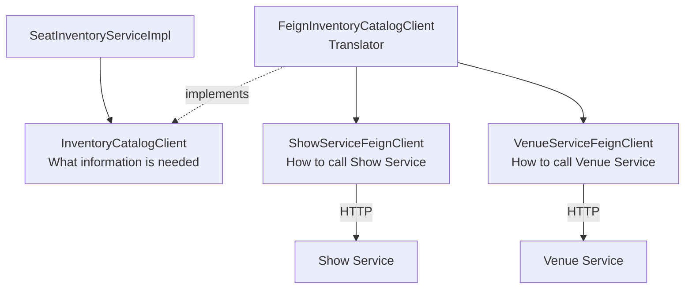

# Why We Have Two Client Layers — Simple Explanation

The Seat Inventory Service contains these client types:

```text
InventoryCatalogClient

ShowServiceFeignClient
VenueServiceFeignClient

FeignInventoryCatalogClient
```

At first, this may look like unnecessary extra code. Each class has a different
job, however.

The simplest way to understand them is:

```text
InventoryCatalogClient
    = what information the business needs

ShowServiceFeignClient / VenueServiceFeignClient
    = how to obtain that information over HTTP

FeignInventoryCatalogClient
    = the translator that connects the two
```

## Simple restaurant analogy

Imagine that you are a customer in a restaurant.

You say:

```text
“Give me one coffee.”
```

You do not need to know:

- which coffee machine is used;
- which button is pressed;
- where the beans are stored;
- how the machine handles an error.

Your request describes **what you need**:

```text
One coffee
```

The waiter knows **how to obtain it**:

```text
Walk to the machine
→ select coffee
→ operate the machine
→ bring back the result
```

In this project:

```text
SeatInventoryServiceImpl = customer
InventoryCatalogClient = menu/request understood by the customer
FeignInventoryCatalogClient = waiter
Feign clients = machines used by the waiter
Show/Venue Services = kitchens that produce the information
```

The business service asks for information without knowing the HTTP details.

## Layer 1: `InventoryCatalogClient`

The interface is:

```java
public interface InventoryCatalogClient {

    ShowSummary getShow(Long showId);

    ScreenSummary getScreen(Long screenId);

    List<ScreenSeatSummary> getScreenSeats(Long screenId);
}
```

This interface describes what Seat Inventory needs:

```text
Give me show information
Give me screen information
Give me the seats for a screen
```

It does not know:

- the Show Service URL;
- the Venue Service URL;
- whether the request uses HTTP;
- the endpoint paths;
- whether `screenId` is a path variable or query parameter;
- what exception Feign throws;
- the complete response returned by another service.

This is the business-facing client contract.

`SeatInventoryServiceImpl` depends on it:

```java
private final InventoryCatalogClient inventoryCatalogClient;
```

The business service then writes simple code:

```java
ShowSummary show = inventoryCatalogClient.getShow(showId);

ScreenSummary screen =
        inventoryCatalogClient.getScreen(show.screenId());

List<ScreenSeatSummary> seats =
        inventoryCatalogClient.getScreenSeats(show.screenId());
```

That code communicates the business intention clearly.

## Layer 2: Feign clients

The Show Service Feign interface is:

```java
@FeignClient(
    name = "show-service",
    url = "${clients.show-service.base-url}"
)
public interface ShowServiceFeignClient {

    @GetMapping("/api/v1/shows/{showId}")
    ShowServiceResponse getShow(
        @PathVariable("showId") Long showId
    );
}
```

This interface knows exactly how to call Show Service.

For show `101`, it knows that the HTTP request must be:

```http
GET http://localhost:8083/api/v1/shows/101
```

The Venue Service Feign interface knows how to call Venue Service:

```java
@GetMapping("/api/v1/screens/{screenId}")
ScreenServiceResponse getScreen(
    @PathVariable("screenId") Long screenId
);

@GetMapping("/api/v1/seats")
List<SeatServiceResponse> getScreenSeats(
    @RequestParam("screenId") Long screenId
);
```

For screen `10`, those calls become:

```http
GET http://localhost:8082/api/v1/screens/10
```

and:

```http
GET http://localhost:8082/api/v1/seats?screenId=10
```

Feign clients therefore contain transport details:

```text
HTTP method
URL
Path
Path variables
Query parameters
External response format
Remote client name
```

## The adapter: `FeignInventoryCatalogClient`

The adapter connects the business interface to the HTTP clients:

```java
public class FeignInventoryCatalogClient
        implements InventoryCatalogClient {

    private final ShowServiceFeignClient showServiceClient;
    private final VenueServiceFeignClient venueServiceClient;
}
```

The important word is:

```java
implements InventoryCatalogClient
```

It promises to provide everything requested by the business interface.

It uses Feign internally to obtain that information.

```text
Business request
→ adapter
→ Feign HTTP request
→ remote service
→ Feign response
→ adapter translates response
→ business result
```

## One complete example: `getShow(101)`

### Step 1: Business service asks for a show

```java
InventoryCatalogClient.ShowSummary show =
        inventoryCatalogClient.getShow(101L);
```

`SeatInventoryServiceImpl` only knows that it needs a show summary.

### Step 2: Spring selects the implementation

`FeignInventoryCatalogClient` implements `InventoryCatalogClient`, so Spring
injects it into `SeatInventoryServiceImpl`.

The call becomes:

```java
feignInventoryCatalogClient.getShow(101L);
```

### Step 3: Adapter calls the Feign interface

Inside the adapter:

```java
ShowServiceResponse response = call(
    () -> showServiceClient.getShow(101L),
    "Show not found with id: 101",
    "show-service"
);
```

### Step 4: Feign creates the HTTP request

Feign reads:

```java
@GetMapping("/api/v1/shows/{showId}")
```

and creates:

```http
GET http://localhost:8083/api/v1/shows/101
```

### Step 5: Show Service responds

Example response:

```json
{
  "id": 101,
  "eventId": "event-7",
  "venueId": 1,
  "screenId": 10,
  "status": "SCHEDULED",
  "basePrice": 250.00
}
```

Feign converts the needed fields to:

```java
ShowServiceResponse(
    101L,
    1L,
    10L,
    "SCHEDULED"
)
```

### Step 6: Adapter converts the external response

The adapter returns:

```java
new ShowSummary(
    response.id(),
    response.venueId(),
    response.screenId(),
    response.status()
);
```

The external Feign response has now become the business model expected by Seat
Inventory.

### Step 7: Business service uses it

`SeatInventoryServiceImpl` receives:

```java
ShowSummary(
    id = 101,
    venueId = 1,
    screenId = 10,
    status = "SCHEDULED"
)
```

It can now validate:

```text
Does the returned ID match 101?
Is the status SCHEDULED?
What screen should be used?
What venue should own the screen?
```

## Visual structure



## Why not call Feign directly from the service?

We could write:

```java
public class SeatInventoryServiceImpl {

    private final ShowServiceFeignClient showClient;
    private final VenueServiceFeignClient venueClient;
}
```

This works for a small application, but the business service would then know:

- which remote service owns each endpoint;
- Feign-specific response records;
- Feign-specific exceptions;
- HTTP failure behavior;
- how several remote APIs combine into one business dependency.

The service could become mixed code:

```text
Seat business validation
+ HTTP integration details
+ Feign exception handling
+ remote response conversion
```

Using the adapter keeps it separated:

```text
SeatInventoryServiceImpl
    = seat inventory business rules

FeignInventoryCatalogClient
    = integration and error translation

Feign interfaces
    = exact HTTP contracts
```

## Error translation example

Suppose this remote call returns `404`:

```http
GET /api/v1/shows/999
```

Feign throws:

```java
FeignException.NotFound
```

The business service should not need to understand that Feign exception.

The adapter converts it:

```java
catch (FeignException.NotFound ex) {
    throw new ResourceNotFoundException(
        "Show not found with id: 999"
    );
}
```

The business/API layers now receive an application exception instead of a
Feign-specific exception.

Similarly:

```text
Feign timeout or connection failure
→ RetryableException
→ adapter converts it
→ ExternalServiceException
→ API returns 503 Service Unavailable
```

This is another translation performed by the adapter.

## Why separate response records exist?

The Feign interface has:

```java
ShowServiceResponse
```

The business interface has:

```java
ShowSummary
```

They may currently contain similar fields, but they have different meanings.

```text
ShowServiceResponse
    = the JSON contract returned by another service

ShowSummary
    = the information Seat Inventory wants to use
```

If Show Service changes its response later, conversion changes can remain in
the adapter.

For example, Show Service could later return:

```json
{
  "id": 101,
  "location": {
    "venueId": 1,
    "screenId": 10
  }
}
```

The adapter could still return the same business object:

```java
ShowSummary(101L, 1L, 10L, "SCHEDULED")
```

`SeatInventoryServiceImpl` would not need to change.

## Why testing becomes easier

Business tests can mock:

```java
@Mock
private InventoryCatalogClient inventoryCatalogClient;
```

Then they can define simple business data:

```java
when(inventoryCatalogClient.getShow(101L))
    .thenReturn(
        new ShowSummary(
            101L,
            1L,
            10L,
            "SCHEDULED"
        )
    );
```

The business test does not need to configure:

- HTTP servers;
- URLs;
- JSON responses;
- Feign exceptions;
- network timeouts.

Separate adapter tests can focus specifically on Feign conversion and error
translation.

This produces two focused test groups:

```text
SeatInventoryServiceImplTests
    → test business rules

FeignInventoryCatalogClientTests
    → test HTTP response mapping and exception translation
```

## Could we replace Feign later?

Yes. Suppose we later want to read catalog information from another source.

We could create:

```java
public class CachedInventoryCatalogClient
        implements InventoryCatalogClient {
}
```

or:

```java
public class MessageBasedInventoryCatalogClient
        implements InventoryCatalogClient {
}
```

As long as the new implementation satisfies:

```java
InventoryCatalogClient
```

the business service can continue asking:

```java
inventoryCatalogClient.getShow(showId);
```

This does not mean replacement will always be effortless, but the business
code is less tightly coupled to Feign.

## Is having two layers always necessary?

No.

For a tiny prototype with one remote call, directly injecting a Feign client
may be acceptable.

The extra business interface and adapter become valuable when:

- several remote services are combined;
- errors need translation;
- remote DTOs differ from business models;
- business tests should not know HTTP details;
- the integration may change later;
- you want a clean boundary between domain logic and infrastructure.

This service calls both Show and Venue Services, maps several response types,
and translates failure modes. Therefore, the adapter layer is useful here.

## One-line meaning of every class

### `SeatInventoryServiceImpl`

```text
Uses show, screen, and seat information to enforce inventory business rules.
```

### `InventoryCatalogClient`

```text
Defines the external information required by Seat Inventory.
```

### `FeignInventoryCatalogClient`

```text
Obtains that information through Feign and translates it for the business.
```

### `ShowServiceFeignClient`

```text
Defines the exact HTTP call to Show Service.
```

### `VenueServiceFeignClient`

```text
Defines the exact HTTP calls to Venue Service.
```

## Final summary

Remember these three questions:

```text
1. What information does the business need?
   → InventoryCatalogClient

2. How is the remote HTTP endpoint called?
   → ShowServiceFeignClient / VenueServiceFeignClient

3. Who translates between them?
   → FeignInventoryCatalogClient
```

The complete call direction is:

```text
SeatInventoryServiceImpl
→ InventoryCatalogClient
→ FeignInventoryCatalogClient
→ Show/Venue Feign clients
→ Show/Venue HTTP services
```

The result returns in the opposite direction:

```text
Remote JSON
→ Feign response record
→ adapter conversion
→ business summary
→ SeatInventoryServiceImpl
```

The main lesson is:

> Business code says what it needs. Feign code knows how to call HTTP. The
> adapter translates between the two.
