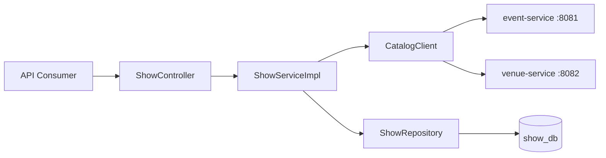
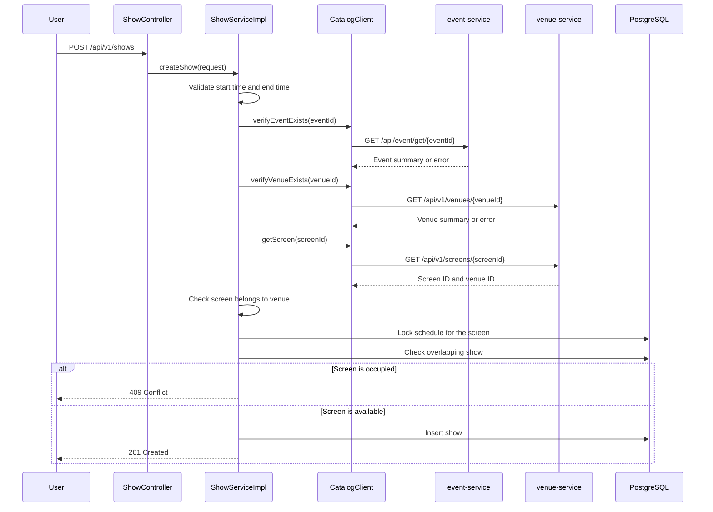
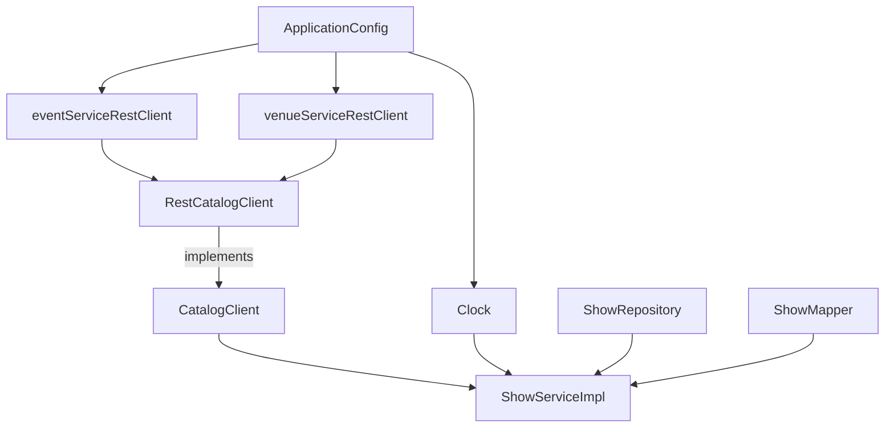

# Show Service Client and Configuration Flow

This guide explains how `show-service` communicates with `event-service` and
`venue-service` when a show is created.

In this project, a **client** is Java code that calls another microservice over
HTTP. It is not a frontend or browser client.

## High-level architecture

`show-service` owns show scheduling data. It stores only the IDs of the related
resources:

- `eventId`
- `venueId`
- `screenId`

It does not store complete Event, Venue, or Screen objects. Instead, it calls
the services that own those resources whenever it needs to validate them.



## Create-show request flow



The validation order is:

1. Start time must be before end time.
2. Start time must be in the future.
3. Event must exist.
4. Venue must exist.
5. Screen must exist.
6. Screen must belong to the supplied venue.
7. The screen schedule is locked for the current transaction.
8. The requested time must not overlap another active show.
9. The new show is saved.

## `CatalogClient`

`CatalogClient` is an interface:

```java
public interface CatalogClient {

    void verifyEventExists(Long eventId);

    void verifyVenueExists(Long venueId);

    ScreenSummary getScreen(Long screenId);

    record ScreenSummary(Long id, Long venueId) {
    }
}
```

The interface defines what the show service needs from other services without
including HTTP implementation details.

`verifyEventExists` and `verifyVenueExists` return `void` because the show
service only needs to know whether those resources exist. A valid resource
causes the method to return normally. An invalid resource causes an exception.

`getScreen` returns a small `ScreenSummary` because the show service needs the
screen's `venueId` to check ownership:

```java
if (!venueId.equals(screen.venueId())) {
    throw new InvalidReferenceException(
            "Screen " + screenId + " does not belong to venue " + venueId
    );
}
```

Only the required fields are transferred. The full screen object is not stored
by `show-service`.

## `RestCatalogClient`

`RestCatalogClient` is the HTTP implementation of `CatalogClient`:

```java
@Component
@RequiredArgsConstructor
public class RestCatalogClient implements CatalogClient {

    @Qualifier("eventServiceRestClient")
    private final RestClient eventServiceRestClient;

    @Qualifier("venueServiceRestClient")
    private final RestClient venueServiceRestClient;
}
```

- `@Component` tells Spring to create and manage this class.
- `@RequiredArgsConstructor` lets Lombok generate a constructor for the final
  fields.
- `@Qualifier` tells Spring which `RestClient` bean to inject because there are
  two beans with the same Java type.

### Event validation request

```java
EventSummary event = eventServiceRestClient.get()
        .uri("/api/event/get/{id}", eventId)
        .retrieve()
        .onStatus(HttpStatusCode::is4xxClientError,
                (request, response) -> {
                    throw new InvalidReferenceException(
                            "Event not found with id: " + eventId
                    );
                })
        .body(EventSummary.class);
```

For `eventId = 1`, the final request is:

```text
GET http://localhost:8081/api/event/get/1
```

The response is mapped to:

```java
private record EventSummary(String id) {
}
```

Other event fields are ignored because show-service does not need them.

### Venue validation request

For `venueId = 1`, the client sends:

```text
GET http://localhost:8082/api/v1/venues/1
```

Only the venue ID is read:

```java
private record VenueSummary(Long id) {
}
```

### Screen validation request

For `screenId = 10`, the client sends:

```text
GET http://localhost:8082/api/v1/screens/10
```

It reads only:

```java
record ScreenSummary(Long id, Long venueId) {
}
```

This allows show-service to verify that the requested screen belongs to the
requested venue.

## Client error handling

The client separates invalid data from infrastructure problems.

### Invalid reference

Examples:

- Event does not exist.
- Venue does not exist.
- Screen does not exist.
- Screen belongs to a different venue.

These cases throw `InvalidReferenceException`. The global exception handler
returns `400 Bad Request`.

### External service failure

Examples:

- event-service is stopped.
- venue-service is stopped.
- The connection cannot be opened.
- The external service takes too long to respond.
- The external service returns a server error.

These cases throw `ExternalServiceException`. The global exception handler
returns `503 Service Unavailable`.

## `ApplicationConfig`

`ApplicationConfig` creates the objects that are shared and injected by Spring.

```java
@Configuration
public class ApplicationConfig {
}
```

`@Configuration` tells Spring that the class contains bean definitions.

### Application clock

```java
@Bean
Clock applicationClock(@Value("${app.time-zone}") String timeZone) {
    return Clock.system(ZoneId.of(timeZone));
}
```

The clock is used for future-time validation:

```java
LocalDateTime.now(clock)
```

Injecting a `Clock` makes the time zone configurable and makes automated tests
predictable because tests can use a fixed clock.

### Event-service RestClient

```java
@Bean("eventServiceRestClient")
RestClient eventServiceRestClient(
        ClientTimeoutProperties timeouts,
        @Value("${clients.event-service.base-url}") String baseUrl
) {
    return buildClient(baseUrl, timeouts);
}
```

This bean is configured with the event-service base URL.

### Venue-service RestClient

```java
@Bean("venueServiceRestClient")
RestClient venueServiceRestClient(
        ClientTimeoutProperties timeouts,
        @Value("${clients.venue-service.base-url}") String baseUrl
) {
    return buildClient(baseUrl, timeouts);
}
```

This bean is configured with the venue-service base URL.

### Shared client builder

```java
private RestClient buildClient(
        String baseUrl,
        ClientTimeoutProperties timeouts
) {
    SimpleClientHttpRequestFactory requestFactory =
            new SimpleClientHttpRequestFactory();

    requestFactory.setConnectTimeout(timeouts.connectTimeout());
    requestFactory.setReadTimeout(timeouts.readTimeout());

    return RestClient.builder()
            .baseUrl(baseUrl)
            .requestFactory(requestFactory)
            .build();
}
```

The connection timeout controls how long the application waits to establish a
connection. The read timeout controls how long it waits for a response after
the connection has been established.

Timeouts prevent an unavailable dependency from making show-service wait
forever.

## Configuration properties

The relevant settings are in `src/main/resources/application.properties`:

```properties
clients.event-service.base-url=${EVENT_SERVICE_URL:http://localhost:8081}
clients.venue-service.base-url=${VENUE_SERVICE_URL:http://localhost:8082}
clients.connect-timeout=${CLIENT_CONNECT_TIMEOUT:2s}
clients.read-timeout=${CLIENT_READ_TIMEOUT:3s}
app.time-zone=${APP_TIME_ZONE:Asia/Kolkata}
```

The syntax:

```properties
${ENVIRONMENT_VARIABLE:default-value}
```

means:

1. Use the environment variable when it is defined.
2. Otherwise, use the value after the colon.

For example:

```properties
${EVENT_SERVICE_URL:http://localhost:8081}
```

uses `EVENT_SERVICE_URL` in Docker, Kubernetes, or production. During local
development, it defaults to `http://localhost:8081`.

The timeout settings are bound to:

```java
@ConfigurationProperties(prefix = "clients")
public record ClientTimeoutProperties(
        Duration connectTimeout,
        Duration readTimeout
) {
}
```

Spring converts values such as `2s`, `500ms`, and `1m` into Java `Duration`
objects.

The properties record is enabled in `ShowServiceApplication`:

```java
@EnableConfigurationProperties(ClientTimeoutProperties.class)
```

## Dependency injection summary

Spring creates and connects the objects approximately like this:



`ShowServiceImpl` depends on abstractions and reusable Spring beans:

```java
private final ShowRepository showRepository;
private final ShowMapper showMapper;
private final CatalogClient catalogClient;
private final Clock clock;
```

Spring creates these dependencies and supplies them through constructor
injection.

## Important event-ID compatibility note

The current event-service generates UUID string IDs, while this show-service
contract uses:

```java
Long eventId
```

Before complete end-to-end integration, both services must use the same ID
type. The project must choose one of these approaches:

1. Change event-service to use numeric `Long` IDs.
2. Change show-service's `eventId` to `String`.

Microservices that exchange resource IDs must agree on the ID format.
